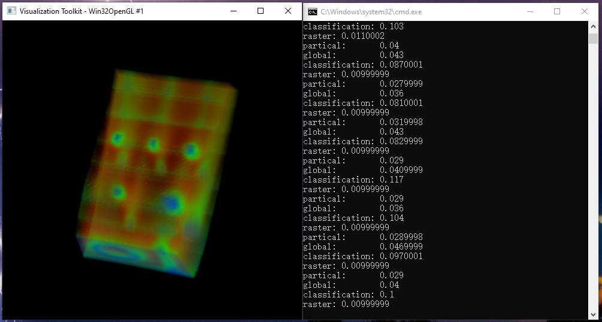

# Abstract

We used multi-threaded parallel methods to optimize the serial PT algorithm. Our algorithm includes two parts :the visibility sorting and classification/decomposition of projection polygons. The visibility sorting part includes partial sorting and global sorting: In partial sorting, we partition disordered tetrahedral depth array and obtain several loosely coupled subarrays, and in global sorting, we sort each subarray with multi-threads technique. In the classification/decomposition of projection polygons part, we normalize tetrahedral projection to ensure arbitrary tetrahedral produces the same number of triangles, and then store the produced vertex data into vertex array with offset computation that ensures correct order for the multi-threads runtime.

The experimental results show that the proposed multi-threaded projection tetrahedral algorithm can achieve a speedup of 3.4X on a 20 cores CPU.

# Required
Our algorithm implemented with vtk-8.2.0, so one must compile the vtk-8.2.0 first. 
# Screenshot

